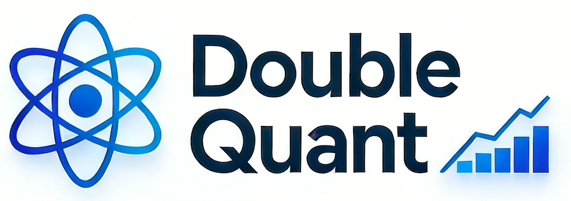

<div align="center">
<h1>
<em>Quant</em>um  
<em>Quant</em>itative
</h1>
</div>
<br>

[](https://www.python.org/downloads/)
[
](LICENSE)

# Double Quant

**Double Quant** - A high-performance quantum computing framework for solving quantitative finance problems.

## 🌟 Overview

Double Quant is a framework that bridges quantum computing and quantitative finance. By leveraging quantum algorithms and advanced optimization techniques, it provides efficient solutions to complex financial computational problems.

### Key Features

- **🚀 Optimized Quantum Solvers**: State-of-the-art quantum solvers, including lots of bottom-level optimization algorithms.
- **🎯 Three-Layer Architecture**: Clean separation of concerns with Data → Solver → Application layers.
- **📊 Type-Safe Design**: Full type hints support for better IDE integration and code reliability.
- **🔧 Easy to Use**: Intuitive API design that makes quantum finance accessible to practitioners.
- **⚙️ Modular Structure**: Flexible components that can be combined for various financial applications.

## 🏗️ Architecture

Double Quant follows a well-designed three-layer architecture:

```
┌─────────────────────────────────────┐
│         Application Layer           │
│      (Portfolio, Pricing, ...)      │
└─────────────────────────────────────┘
                  ↓
┌─────────────────────────────────────┐
│           Solver Layer              │
│             (VQA, HHL, ...)         │
└─────────────────────────────────────┘
                  ↓
┌─────────────────────────────────────┐
│            Data Layer               │
│        (Stock data, ...)            │
└─────────────────────────────────────┘
```

### Layer Responsibilities

- **Data Layer** (`double_quant.common`): Core data structures and utilities.

- **Solver Layer** (`double_quant.solver`): Quantum algorithms and solvers.

- **Application Layer**: High-level financial applications
  - Portfolio optimization
  - Option pricing
  - Risk analysis
  - (More coming soon...)

## 📦 Installation

### Prerequisites

- Python 3.11 or higher
- [uv](https://github.com/astral-sh/uv) package manager (recommended)

### Install with uv (Recommended)

```bash
# Clone the repository
git clone https://github.com/yourusername/double-quant.git
cd double-quant

# Install dependencies
uv sync
```

### Install with pip

```bash
# Clone the repository
git clone https://github.com/yourusername/double-quant.git
cd double-quant

# Install in development mode
pip install -e .
```

## 🚀 Quick Start

### Example: Solving a Linear System

```python
from double_quant import LinearSystem, QuantumLinearSolver

# Define a linear system Ax = b
A = [[4, 1], [1, 3]]
b = [1, 2]

# Create a linear system model
system = LinearSystem(A, b)

# Initialize quantum solver
solver = QuantumLinearSolver()

# Solve the system
solution = solver.solve(system)

print(f"Solution: {solution}")
```

### Example: Using SAPO Optimizer

```python
from double_quant import SAPO, LinearSystem
from double_quant.solver import QuantumLinearSolver

# Create a linear system
system = LinearSystem([[2, 1], [1, 2]], [1, 1])

# Use SAPO optimizer for better performance
optimizer = SAPO()
solver = QuantumLinearSolver(optimizer=optimizer)

# Solve with optimization
solution = solver.solve(system)
```

## 🔬 Core Components

### Quantum Linear Solver

The `QuantumLinearSolver` implements the HHL (Harrow-Hassidim-Lloyd) algorithm, one of the most important quantum algorithms for solving linear systems exponentially faster than classical methods.

## 📚 Documentation

For detailed documentation, API reference, and tutorials, visit our [documentation site](https://docs.double-quant.io) (coming soon).

## 🛠️ Development

### Running Tests

```bash
# Run all tests
uv run pytest

# Run with coverage
uv run pytest --cov=double_quant
```

### Building the Package

```bash
uv build
```

### Code Style

This project follows ruff guidelines and uses type hints throughout.

## 🤝 Contributing

We welcome contributions! Whether it's bug reports, feature requests, or code contributions, please feel free to get involved.

1. Fork the repository
2. Create your feature branch (`git checkout -b feature/amazing-feature`)
3. Commit your changes (`git commit -m 'feat(scope): add amazing feature'`)
4. Push to the branch (`git push origin feature/amazing-feature`)
5. Open a Pull Request

### Commit Message Format

We follow the Angular commit message convention:

```
<type>(<scope>): <description>

[optional body]

[optional footer]
```

**Types**: `feat`, `fix`, `docs`, `style`, `refactor`, `test`, `chore`

## 📄 License

This project is licensed under the GPLv3 - see the [LICENSE](LICENSE) file for details.

## 🙏 Acknowledgments

This project draws inspiration from:

- [Qiskit](https://github.com/Qiskit/qiskit) - Open-source quantum computing framework.
- [Qiskit Finance](https://github.com/qiskit-community/qiskit-finance) - Quantum algorithms for finance and its architecture.

## 🗺️ Roadmap

- [x] Core linear system solver with HHL algorithm
- [ ] Portfolio optimization applications
- [ ] Option pricing modules
- [ ] Risk analysis tools
- [ ] Integration with major quantum computing platforms
- [ ] Comprehensive documentation and tutorials
- [ ] Performance benchmarks
- [ ] Real-world case studies
