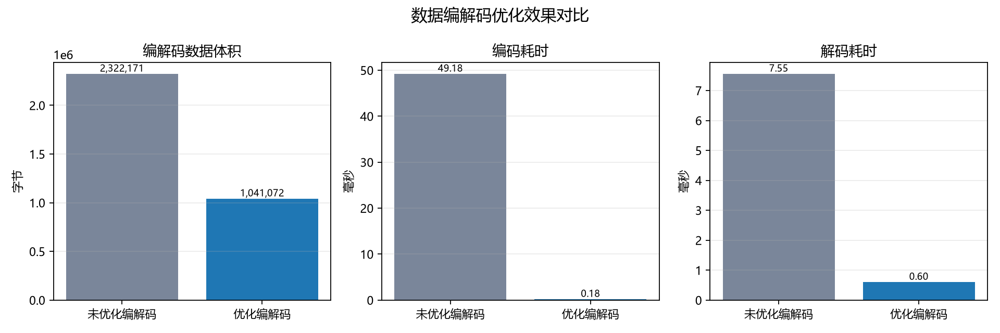

# 76 优化数据编解码功能测试（Func-44） 测试结果

## 运行命令

```bash
uv run pytest tests/double_quant/data/76-data_codec_optimization.py -s
```

## 运行结果

```text
执行状态：通过
收集用例：7

[用例1] 股票价格矩阵二进制编解码后可精确还原。
[用例2] 带时区交易日期索引可正确编码和解码。
[用例3] 文件写入与读取成功，编码数据体积=13288字节。
[用例4] 非 DatetimeIndex 输入被正确拒绝。
[用例5] 非数值列输入被正确拒绝。
[用例6] deflate 模式进一步压缩二进制编码数据：148486 -> 133114 字节。
[用例7] 未优化字节=2322171，优化字节=1041072，体积降低=55.17%。
[用例7] 未优化编码=49.184ms，优化编码=0.184ms，编码加速=267.91x。
[用例7] 未优化解码=7.553ms，优化解码=0.599ms，解码加速=12.61x。
[用例7] 柱状图已生成：tests/docs/76-data-codec-optimization/images/codec_benchmark_bar.png
通过数量：7
```

## 优化效果图



## 关键结果

| 指标 | 未优化编解码 | 优化编解码 | 优化效果 |
|---|---:|---:|---:|
| 编解码数据体积 | 2,322,171 字节 | 1,041,072 字节 | 降低 55.17% |
| 编码耗时 | 49.184 ms | 0.184 ms | 加速 267.91x |
| 解码耗时 | 7.553 ms | 0.599 ms | 加速 12.61x |

## 输出说明

- 单文件测试共覆盖 7 个用例，超过 5 个用例要求。
- 测试数据使用固定随机种子的金融价格矩阵，避免外部网络与行情源波动影响结果。
- 优化编解码在 10000 行、12 列金融时间序列上，相比未优化编解码同时减少编码数据体积并降低编解码耗时。
- 柱状图从同一次测试生成，图中展示了体积、编码耗时、解码耗时三类优化对比。
