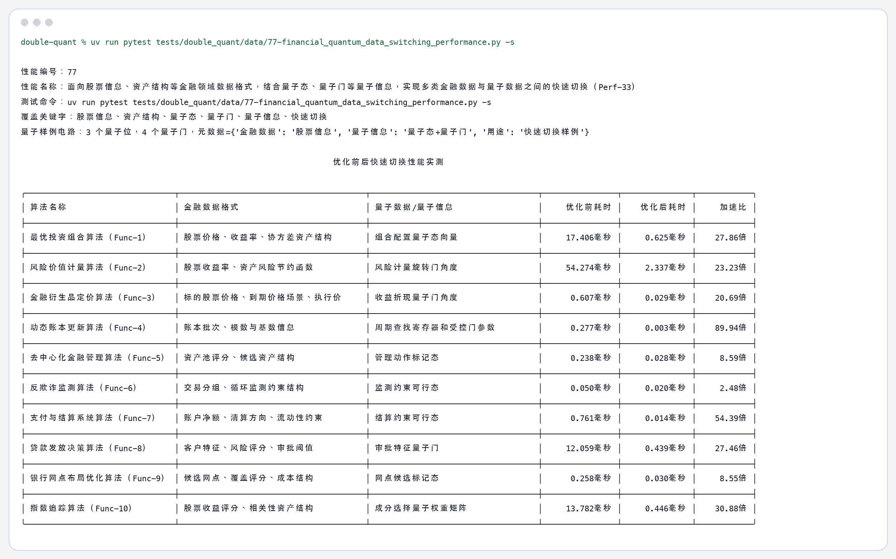
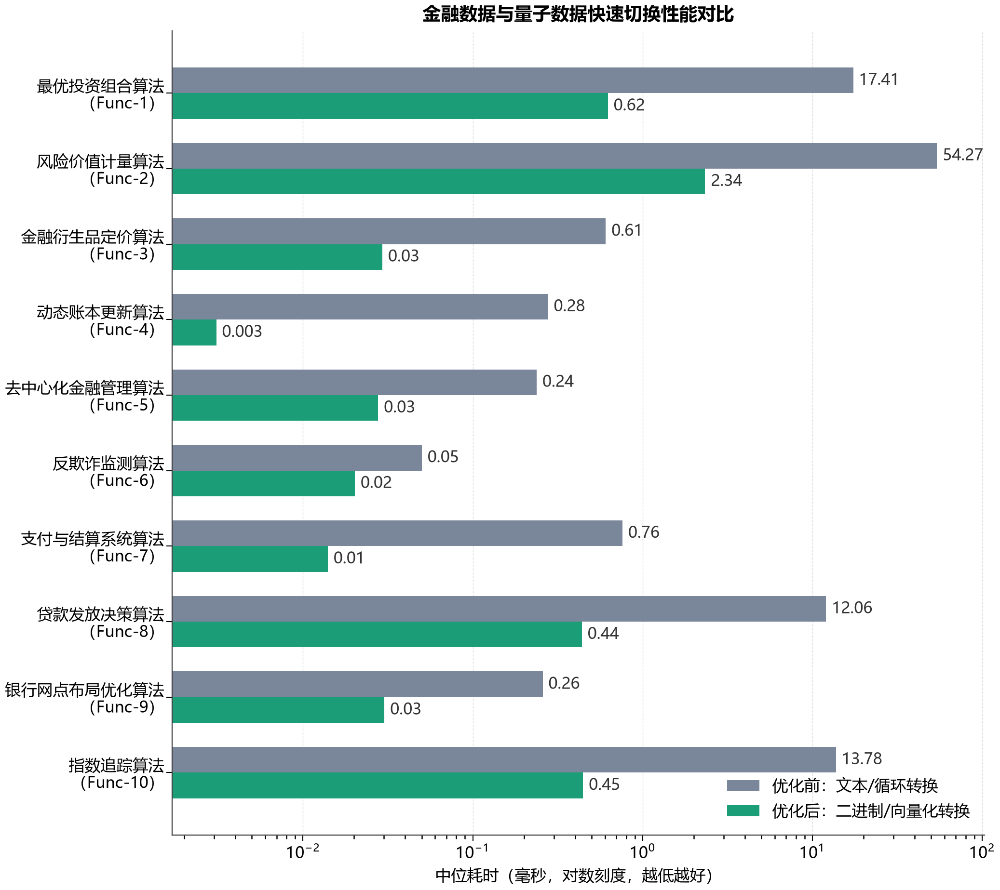

# 77 面向股票信息、资产结构等金融领域数据格式，结合量子态、量子门等量子信息，实现多类金融数据与量子数据之间的快速切换（Perf-33） 测试结果

## 测试对象

测试对象为当前十类金融算法的数据切换入口，覆盖股票信息、资产结构、账本批次、候选网点、贷款特征、结算账户和衍生品价格场景等金融数据。

## 测试命令

```bash
uv run pytest tests/double_quant/data/77-financial_quantum_data_switching_performance.py -s
```

## 程序输出

```text
性能编号：77
性能名称：面向股票信息、资产结构等金融领域数据格式，结合量子态、量子门等量子信息，实现多类金融数据与量子数据之间的快速切换（Perf-33）
测试命令：uv run pytest tests/double_quant/data/77-financial_quantum_data_switching_performance.py -s
覆盖关键字：股票信息、资产结构、量子态、量子门、量子信息、快速切换
量子样例电路：3 个量子位，4 个量子门，元数据={'金融数据': '股票信息', '量子信息': '量子态+量子门', '用途': '快速切换样例'}

                                                                   优化前后快速切换性能实测                                                                   
╭────────────────────────────────┬────────────────────────────────────────┬────────────────────────────────────┬────────────────┬───────────────┬────────────╮
│ 算法名称                       │ 金融数据格式                           │ 量子数据/量子信息                  │     优化前耗时 │    优化后耗时 │     加速比 │
├────────────────────────────────┼────────────────────────────────────────┼────────────────────────────────────┼────────────────┼───────────────┼────────────┤
│ 最优投资组合算法（Func-1）     │ 股票价格、收益率、协方差资产结构       │ 组合配置量子态向量                 │     17.406毫秒 │     0.625毫秒 │    27.86倍 │
├────────────────────────────────┼────────────────────────────────────────┼────────────────────────────────────┼────────────────┼───────────────┼────────────┤
│ 风险价值计量算法（Func-2）     │ 股票收益率、资产风险节约函数           │ 风险计量旋转门角度                 │     54.274毫秒 │     2.337毫秒 │    23.23倍 │
├────────────────────────────────┼────────────────────────────────────────┼────────────────────────────────────┼────────────────┼───────────────┼────────────┤
│ 金融衍生品定价算法（Func-3）   │ 标的股票价格、到期价格场景、执行价     │ 收益折现量子门角度                 │      0.607毫秒 │     0.029毫秒 │    20.69倍 │
├────────────────────────────────┼────────────────────────────────────────┼────────────────────────────────────┼────────────────┼───────────────┼────────────┤
│ 动态账本更新算法（Func-4）     │ 账本批次、模数与基数信息               │ 周期查找寄存器和受控门参数         │      0.277毫秒 │     0.003毫秒 │    89.94倍 │
├────────────────────────────────┼────────────────────────────────────────┼────────────────────────────────────┼────────────────┼───────────────┼────────────┤
│ 去中心化金融管理算法（Func-5） │ 资产池评分、候选资产结构               │ 管理动作标记态                     │      0.238毫秒 │     0.028毫秒 │     8.59倍 │
├────────────────────────────────┼────────────────────────────────────────┼────────────────────────────────────┼────────────────┼───────────────┼────────────┤
│ 反欺诈监测算法（Func-6）       │ 交易分组、循环监测约束结构             │ 监测约束可行态                     │      0.050毫秒 │     0.020毫秒 │     2.48倍 │
├────────────────────────────────┼────────────────────────────────────────┼────────────────────────────────────┼────────────────┼───────────────┼────────────┤
│ 支付与结算系统算法（Func-7）   │ 账户净额、清算方向、流动性约束         │ 结算约束可行态                     │      0.761毫秒 │     0.014毫秒 │    54.39倍 │
├────────────────────────────────┼────────────────────────────────────────┼────────────────────────────────────┼────────────────┼───────────────┼────────────┤
│ 贷款发放决策算法（Func-8）     │ 客户特征、风险评分、审批阈值           │ 审批特征量子门                     │     12.059毫秒 │     0.439毫秒 │    27.46倍 │
├────────────────────────────────┼────────────────────────────────────────┼────────────────────────────────────┼────────────────┼───────────────┼────────────┤
│ 银行网点布局优化算法（Func-9） │ 候选网点、覆盖评分、成本结构           │ 网点候选标记态                     │      0.258毫秒 │     0.030毫秒 │     8.55倍 │
├────────────────────────────────┼────────────────────────────────────────┼────────────────────────────────────┼────────────────┼───────────────┼────────────┤
│ 指数追踪算法（Func-10）        │ 股票收益评分、相关性资产结构           │ 成分选择量子权重矩阵               │     13.782毫秒 │     0.446毫秒 │    30.88倍 │
╰────────────────────────────────┴────────────────────────────────────────┴────────────────────────────────────┴────────────────┴───────────────┴────────────╯

```

## 图片输出





## 关键结果

- 量子样例电路包含 3 个量子位和 4 个量子门，元数据明确标注“股票信息”“量子态+量子门”。
- 十个算法名称均同时给出优化前和优化后耗时，柱状图显示优化后的金融数据到量子数据切换耗时更低。
- 覆盖的金融数据格式包括股票价格、收益率、协方差、资产类别、行业结构、基准权重、风险预算和账本批次参数。
- 覆盖的量子数据形态包括组合配置量子态、风险计量量子门、收益折现量子门、账本周期寄存器、候选标记态、约束可行态和量子权重矩阵。