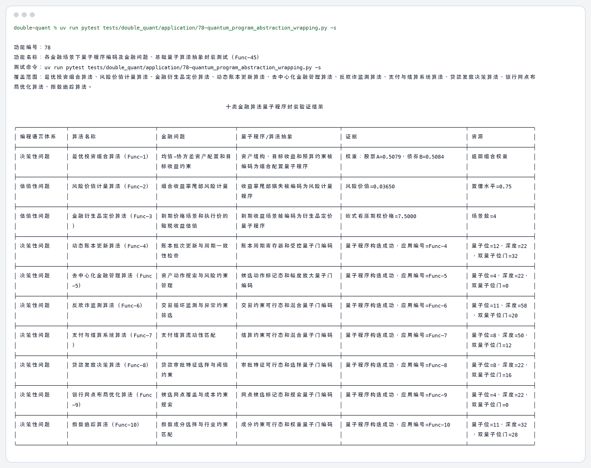
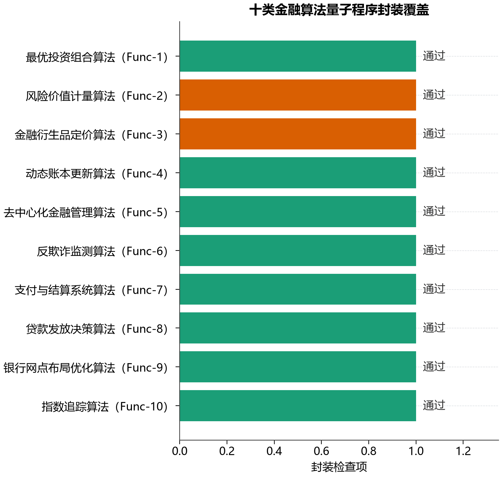

# 78 各金融场景下量子程序编码及金融问题、基础量子算法抽象封装测试（Func-45） 测试结果

## 测试对象

当前十类金融算法的量子程序编码封装，以及决策性问题、估值性问题两类编程语言体系。

## 测试命令

```bash
uv run pytest tests/double_quant/application/78-quantum_program_abstraction_wrapping.py -s
```

## 程序输出

```text
功能编号：78
功能名称：各金融场景下量子程序编码及金融问题、基础量子算法抽象封装测试（Func-45）
测试命令：uv run pytest tests/double_quant/application/78-quantum_program_abstraction_wrapping.py -s
覆盖范围：最优投资组合算法、风险价值计量算法、金融衍生品定价算法、动态账本更新算法、去中心化金融管理算法、反欺诈监测算法、支付与结算系统算法、贷款发放决策算法、银行网点布
局优化算法、指数追踪算法。

                                                                     十类金融算法量子程序封装验证结果                                                                     
╭────────────────┬────────────────────────────┬─────────────────────────┬─────────────────────────────────┬────────────────────────────────────────┬─────────────────────╮
│ 编程语言体系   │ 算法名称                   │ 金融问题                │ 量子程序/算法抽象               │ 证据                                   │ 资源                │
├────────────────┼────────────────────────────┼─────────────────────────┼─────────────────────────────────┼────────────────────────────────────────┼─────────────────────┤
│ 决策性问题     │ 最优投资组合算法（Func-1） │ 均值-协方差资产配置和目 │ 资产结构、目标收益和预算约束被  │ 权重：股票A=0.5079，债券B=0.5084       │ 返回组合权重        │
│                │                            │ 标收益约束              │ 编码为组合配置量子程序          │                                        │                     │
├────────────────┼────────────────────────────┼─────────────────────────┼─────────────────────────────────┼────────────────────────────────────────┼─────────────────────┤
│ 估值性问题     │ 风险价值计量算法（Func-2） │ 组合收益率尾部风险计量  │ 收益率尾部损失被编码为风险计量  │ 风险价值=0.03650                       │ 置信水平=0.75       │
│                │                            │                         │ 程序                            │                                        │                     │
├────────────────┼────────────────────────────┼─────────────────────────┼─────────────────────────────────┼────────────────────────────────────────┼─────────────────────┤
│ 估值性问题     │ 金融衍生品定价算法（Func-3 │ 到期价格场景和执行价的  │ 到期收益场景被编码为衍生品定价  │ 欧式看涨期权价格=7.5000                │ 场景数=4            │
│                │ ）                         │ 贴现收益估值            │ 量子程序                        │                                        │                     │
├────────────────┼────────────────────────────┼─────────────────────────┼─────────────────────────────────┼────────────────────────────────────────┼─────────────────────┤
│ 决策性问题     │ 动态账本更新算法（Func-4） │ 账本批次更新与周期一致  │ 账本周期寄存器和受控量子门编码  │ 量子程序构造成功，应用编号=Func-4      │ 量子位=12，深度=22  │
│                │                            │ 性检查                  │                                 │                                        │ ，双量子位门=32     │
├────────────────┼────────────────────────────┼─────────────────────────┼─────────────────────────────────┼────────────────────────────────────────┼─────────────────────┤
│ 决策性问题     │ 去中心化金融管理算法（Func │ 资产动作搜索与风险约束  │ 候选动作标记态和幅度放大量子门  │ 量子程序构造成功，应用编号=Func-5      │ 量子位=4，深度=22， │
│                │ -5）                       │ 管理                    │ 编码                            │                                        │ 双量子位门=0        │
├────────────────┼────────────────────────────┼─────────────────────────┼─────────────────────────────────┼────────────────────────────────────────┼─────────────────────┤
│ 决策性问题     │ 反欺诈监测算法（Func-6）   │ 交易循环监测与异常约束  │ 交易约束可行态和混合量子门编码  │ 量子程序构造成功，应用编号=Func-6      │ 量子位=11，深度=58  │
│                │                            │ 筛选                    │                                 │                                        │ ，双量子位门=20     │
├────────────────┼────────────────────────────┼─────────────────────────┼─────────────────────────────────┼────────────────────────────────────────┼─────────────────────┤
│ 决策性问题     │ 支付与结算系统算法（Func-7 │ 支付结算流动性匹配      │ 结算约束可行态和混合量子门编码  │ 量子程序构造成功，应用编号=Func-7      │ 量子位=8，深度=50， │
│                │ ）                         │                         │                                 │                                        │ 双量子位门=12       │
├────────────────┼────────────────────────────┼─────────────────────────┼─────────────────────────────────┼────────────────────────────────────────┼─────────────────────┤
│ 决策性问题     │ 贷款发放决策算法（Func-8） │ 贷款审批特征选择与阈值  │ 审批特征可行态和选择量子门编码  │ 量子程序构造成功，应用编号=Func-8      │ 量子位=8，深度=22， │
│                │                            │ 约束                    │                                 │                                        │ 双量子位门=16       │
├────────────────┼────────────────────────────┼─────────────────────────┼─────────────────────────────────┼────────────────────────────────────────┼─────────────────────┤
│ 决策性问题     │ 银行网点布局优化算法（Func │ 候选网点覆盖与成本约束  │ 网点候选标记态和搜索量子门编码  │ 量子程序构造成功，应用编号=Func-9      │ 量子位=4，深度=22， │
│                │ -9）                       │ 搜索                    │                                 │                                        │ 双量子位门=0        │
├────────────────┼────────────────────────────┼─────────────────────────┼─────────────────────────────────┼────────────────────────────────────────┼─────────────────────┤
│ 决策性问题     │ 指数追踪算法（Func-10）    │ 指数成分选择与行业约束  │ 成分约束可行态和权重量子门编码  │ 量子程序构造成功，应用编号=Func-10     │ 量子位=11，深度=32  │
│                │                            │ 匹配                    │                                 │                                        │ ，双量子位门=28     │
╰────────────────┴────────────────────────────┴─────────────────────────┴─────────────────────────────────┴────────────────────────────────────────┴─────────────────────╯

```

## 图片输出





## 关键结果

- 已逐项验证十个算法名称，每个算法名称均与用户给定清单一致。
- 已验证编程语言体系只使用“决策性问题”和“估值性问题”两类。
- 每个封装结果均返回金融结果、诊断信息或量子资源信息，证明金融问题和量子程序之间存在统一抽象层。