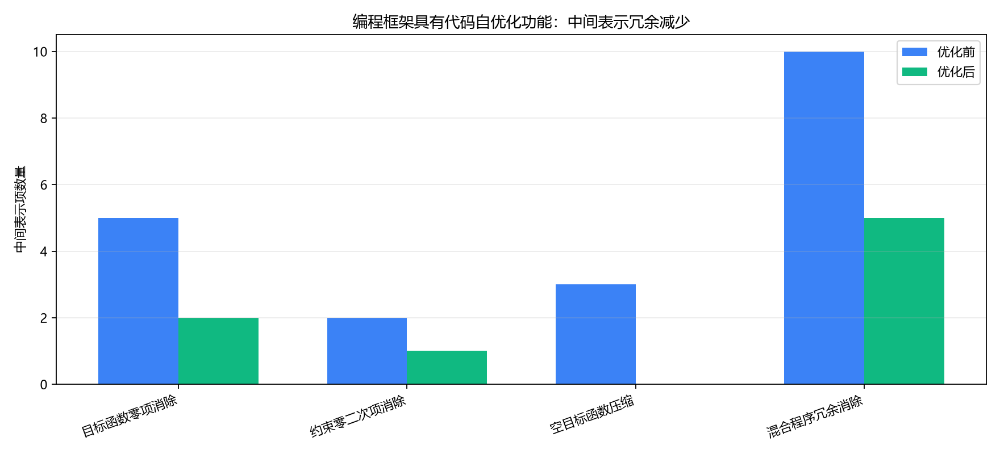

# 81 编程框架代码自优化功能测试（Func-48） 测试结果

## 程序输出

```text
功能编号：81
功能名称：编程框架具有代码自优化功能
测试命令：uv run pytest tests/double_quant/programming/81-code_self_optimization.py
汇总结果：优化前 20 个中间表示项，优化后 8 个中间表示项，减少 12 个冗余项，减少率 60.0%

                                                                  代码自优化运行结果                                                                  
╭─────────────────────────┬───────────┬─────────────────┬─────────────────┬──────────────┬──────────────┬────────────────────────────────────────────╮
│ 用例                    │ 范围      │ 优化前中间表示… │ 优化后中间表示… │     减少冗余 │       减少率 │ 减少原因                                   │
├─────────────────────────┼───────────┼─────────────────┼─────────────────┼──────────────┼──────────────┼────────────────────────────────────────────┤
│ 目标函数零项消除        │ 目标函数  │               5 │               2 │            3 │        60.0% │ 删除零线性项、零二次项和近零常数项         │
├─────────────────────────┼───────────┼─────────────────┼─────────────────┼──────────────┼──────────────┼────────────────────────────────────────────┤
│ 约束零二次项消除        │ 约束      │               2 │               1 │            1 │        50.0% │ 删除约束中的零二次项，使约束中间表示恢复为 │
│                         │           │                 │                 │              │              │ 线性形式                                   │
├─────────────────────────┼───────────┼─────────────────┼─────────────────┼──────────────┼──────────────┼────────────────────────────────────────────┤
│ 空目标函数压缩          │ 目标函数  │               3 │               0 │            3 │       100.0% │ 删除全零目标函数中的无效线性项和二次项     │
├─────────────────────────┼───────────┼─────────────────┼─────────────────┼──────────────┼──────────────┼────────────────────────────────────────────┤
│ 混合程序冗余消除        │ 完整程序  │              10 │               5 │            5 │        50.0% │ 同时删除目标函数和多个约束中的零项/近零项  │
├─────────────────────────┼───────────┼─────────────────┼─────────────────┼──────────────┼──────────────┼────────────────────────────────────────────┤
│ 总计                    │ 汇总      │              20 │               8 │           12 │        60.0% │ 多用例汇总                                 │
╰─────────────────────────┴───────────┴─────────────────┴─────────────────┴──────────────┴──────────────┴────────────────────────────────────────────╯

```

## 结果表格

| 用例 | 范围 | 优化前中间表示项 | 优化后中间表示项 | 减少冗余 | 减少率 | 减少原因 |
|---|---|---:|---:|---:|---:|---|
| 目标函数零项消除 | 目标函数 | 5 | 2 | 3 | 60.0% | 删除零线性项、零二次项和近零常数项 |
| 约束零二次项消除 | 约束 | 2 | 1 | 1 | 50.0% | 删除约束中的零二次项，使约束中间表示恢复为线性形式 |
| 空目标函数压缩 | 目标函数 | 3 | 0 | 3 | 100.0% | 删除全零目标函数中的无效线性项和二次项 |
| 混合程序冗余消除 | 完整程序 | 10 | 5 | 5 | 50.0% | 同时删除目标函数和多个约束中的零项/近零项 |
| 总计 | 汇总 | 20 | 8 | 12 | 60.0% | 多用例汇总 |

## 图像导出


