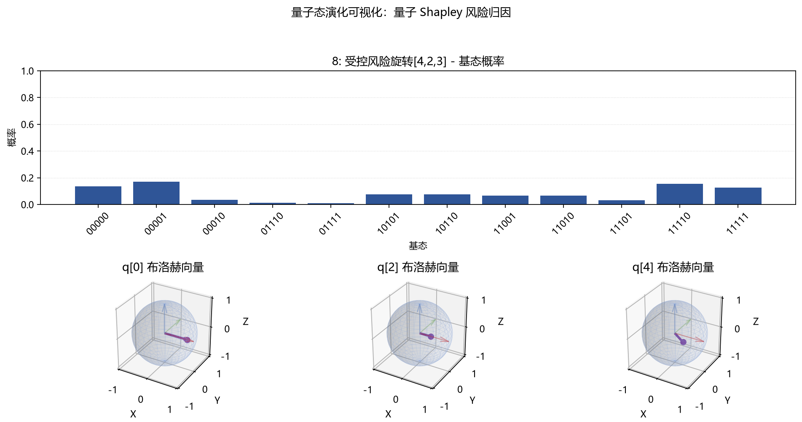
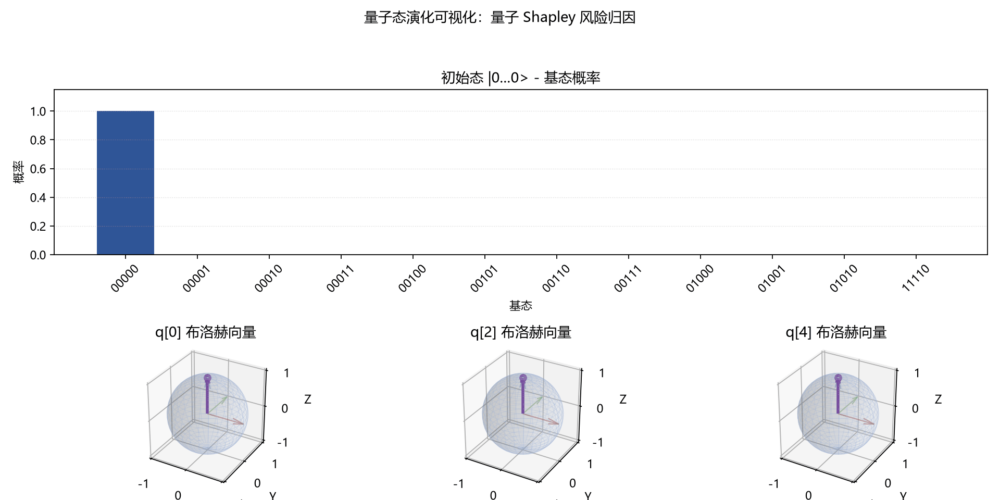

# 82 量子态演化可视化功能测试（Func-49） 测试结果

## 运行命令

```bash
uv run pytest tests/double_quant/circuit/82-quantum_state_evolution_visualization.py -s
```

## 算法场景

本功能使用 `double_quant.application.risk.RiskSavingValueFunction` 构造三资产风险节约特征函数，并通过 `QuantumShapleyCalculator.build_player_circuit(target_player=0)` 生成量子 Shapley 风险归因预言机电路。

资产示例为 `AAPL`、`MSFT`、`TLT` 的离线收益率数据，不依赖网络数据源。

## 运行输出

```text
[量子态演化可视化] 量子 Shapley 风险归因态演化
风险贡献归一化因子：0.01925000
静态图：tests/docs/82-state-evolution-visualization/images/quantum_shapley_state_snapshot.png
GIF 动图：tests/docs/82-state-evolution-visualization/images/quantum_shapley_state_evolution.gif
演化步数：9
输出振幅概率 P(output=1)：0.61495482
最终概率归一化和：1.00000000
跟踪 布洛赫球 量子比特：(0, 2, 4)
```

## 图片导出

静态图展示最终状态的基态概率分布，并对内部区间量子比特、玩家量子比特和输出量子比特绘制布洛赫球。



GIF 动图逐步展示 量子 Shapley 风险归因电路执行过程中概率分布与 布洛赫向量的变化。



## 说明

本次提交未执行 pytest；原因是项目 `AGENTS.md` 明确要求“Do not run tests unless the user explicitly requests it”。已通过非 pytest 导出脚本生成上述 PNG 和 GIF，验证公开 API 能正常运行。
