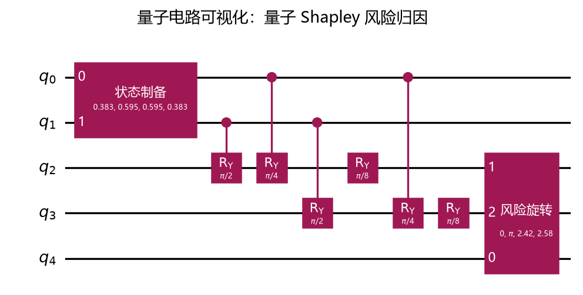

# 83 量子电路可视化功能测试（Func-50） 测试结果

## 运行命令

```bash
uv run pytest tests/double_quant/circuit/83-quantum_circuit_visualization.py -s
```

## 算法场景

本功能可视化量子 Shapley 风险归因预言机电路。电路由三资产风险节约特征函数生成，对目标资产 `AAPL` 的边际风险贡献进行振幅编码。

## 运行输出

```text
[量子电路可视化] 量子 Shapley 风险归因电路
导出图片：tests/docs/83-circuit-visualization/images/quantum_shapley_risk_circuit.png
门操作统计：{'cry': 4, 'ry': 2, 'state_preparation': 1, 'ucry': 1}
```

电路包含 5 个量子比特：

| 量子比特区间 | 含义 |
|---|---|
| `q[0:2]` | 内部量子比特，用于 Shapley 权重区间加载 |
| `q[2:4]` | 玩家量子比特，用于编码目标玩家之外的资产子集 |
| `q[4]` | 输出量子比特，用于读取边际风险贡献振幅 |

## 图片导出



## 说明

本次提交未执行 pytest；原因是项目 `AGENTS.md` 明确要求“Do not run tests unless the user explicitly requests it”。已通过非 pytest 导出脚本生成上述电路图，验证公开 API 能正常运行。
