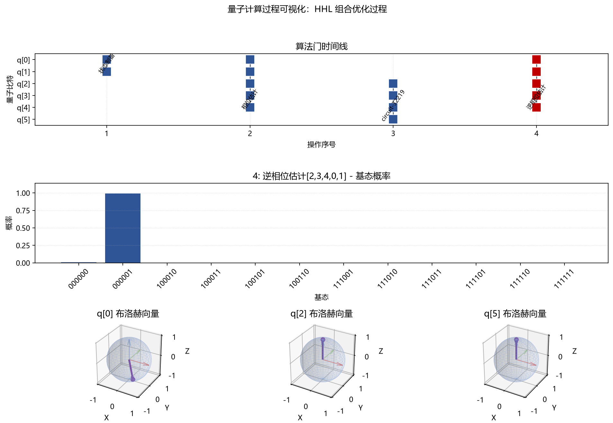
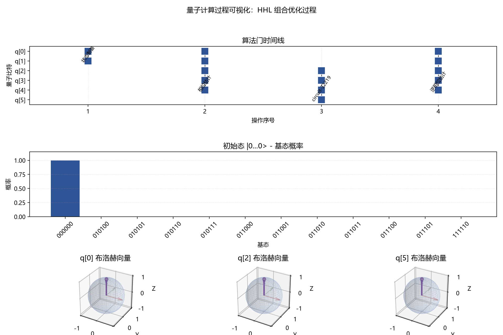

# 84 量子计算过程可视化功能测试（Func-51） 测试结果

## 运行命令

```bash
uv run pytest tests/double_quant/circuit/84-quantum_computation_process_visualization.py -s
```

## 算法场景

本功能使用 HHL/SAPO 线性系统电路展示组合优化计算过程。示例为 2 资产 Markowitz 约束系统：

```text
资产期望收益：mu = [0.08, 0.12]
协方差矩阵：[[0.04, 0.01], [0.01, 0.09]]
目标收益：0.10
```

该系统扩展为 4 维线性系统后进入 `HHLSolver.build_circuit(..., max_qpe_qubits=3)`。

## 运行输出

```text
[量子计算过程可视化] HHL 组合优化过程
静态图：tests/docs/84-computation-process-visualization/images/portfolio_hhl_process_snapshot.png
GIF 动图：tests/docs/84-computation-process-visualization/images/portfolio_hhl_computation_process.gif
操作序列：('1: State Preparation[0,1]', '2: QPE[2,3,4,0,1]', '3: circuit-*[5,4,3,2]', '4: QPE_dg[2,3,4,0,1]')
```

## 图片导出

静态图展示 HHL 计算结束时的门级时间线、最终基态概率分布和关键量子比特的布洛赫球。



GIF 动图展示状态制备、量子相位估计、受控倒数旋转和逆相位估计的逐步计算过程。



## 说明

本次提交未执行 pytest；原因是项目 `AGENTS.md` 明确要求“Do not run tests unless the user explicitly requests it”。已通过非 pytest 导出脚本生成上述 PNG 和 GIF，验证公开 API 能正常运行。
