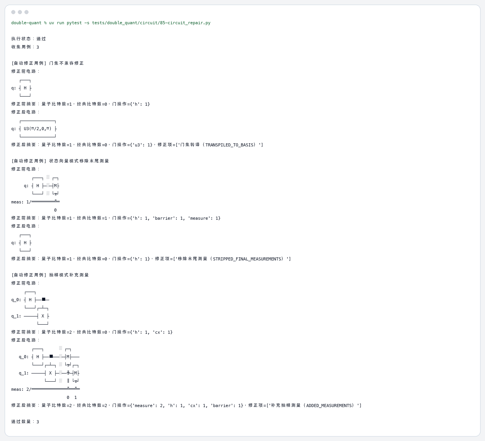

# 85 量子程序自动修正技术测试（Func-52） 测试结果

## 运行命令

```bash
uv run pytest -s tests/double_quant/circuit/85-circuit_repair.py
```

## 运行结果

```text
执行状态：通过
收集用例：3

[自动修正用例] 门集不兼容修正
修正前电路：
   ┌───┐
q: ┤ H ├
   └───┘
修正前摘要：量子比特数=1，经典比特数=0，门操作={'h': 1}
修正后电路：
   ┌─────────────┐
q: ┤ U3(π/2,0,π) ├
   └─────────────┘
修正后摘要：量子比特数=1，经典比特数=0，门操作={'u3': 1}，修正项=['门集转译（TRANSPILED_TO_BASIS）']

[自动修正用例] 状态向量模式移除末尾测量
修正前电路：
        ┌───┐ ░ ┌─┐
     q: ┤ H ├─░─┤M├
        └───┘ ░ └╥┘
meas: 1/═════════╩═
                 0 
修正前摘要：量子比特数=1，经典比特数=1，门操作={'h': 1, 'barrier': 1, 'measure': 1}
修正后电路：
   ┌───┐
q: ┤ H ├
   └───┘
修正后摘要：量子比特数=1，经典比特数=0，门操作={'h': 1}，修正项=['移除末尾测量（STRIPPED_FINAL_MEASUREMENTS）']

[自动修正用例] 抽样模式补充测量
修正前电路：
     ┌───┐     
q_0: ┤ H ├──■──
     └───┘┌─┴─┐
q_1: ─────┤ X ├
          └───┘
修正前摘要：量子比特数=2，经典比特数=0，门操作={'h': 1, 'cx': 1}
修正后电路：
        ┌───┐      ░ ┌─┐   
   q_0: ┤ H ├──■───░─┤M├───
        └───┘┌─┴─┐ ░ └╥┘┌─┐
   q_1: ─────┤ X ├─░──╫─┤M├
             └───┘ ░  ║ └╥┘
meas: 2/══════════════╩══╩═
                      0  1 
修正后摘要：量子比特数=2，经典比特数=2，门操作={'measure': 2, 'h': 1, 'cx': 1, 'barrier': 1}，修正项=['补充抽样测量（ADDED_MEASUREMENTS）']

通过数量：3
```

## 终端截图


