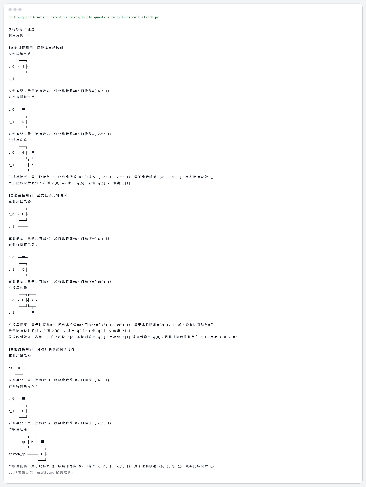

# 86 量子程序智能拼接技术测试（Func-53） 测试结果

## 运行命令

```bash
uv run pytest -s tests/double_quant/circuit/86-circuit_stitch.py
```

## 运行结果

```text
执行状态：通过
收集用例：4

[智能拼接用例] 同线宽自动映射
左侧原始电路：
     ┌───┐
q_0: ┤ H ├
     └───┘
q_1: ─────
          
左侧摘要：量子比特数=2，经典比特数=0，门操作={'h': 1}
右侧待拼接电路：
          
q_0: ──■──
     ┌─┴─┐
q_1: ┤ X ├
     └───┘
右侧摘要：量子比特数=2，经典比特数=0，门操作={'cx': 1}
拼接后电路：
     ┌───┐     
q_0: ┤ H ├──■──
     └───┘┌─┴─┐
q_1: ─────┤ X ├
          └───┘
拼接后摘要：量子比特数=2，经典比特数=0，门操作={'h': 1, 'cx': 1}，量子比特映射={0: 0, 1: 1}，经典比特映射={}
量子比特映射明细：右侧 q[0] -> 输出 q[0]，右侧 q[1] -> 输出 q[1]

[智能拼接用例] 显式量子比特映射
左侧原始电路：
     ┌───┐
q_0: ┤ X ├
     └───┘
q_1: ─────
          
左侧摘要：量子比特数=2，经典比特数=0，门操作={'x': 1}
右侧待拼接电路：
          
q_0: ──■──
     ┌─┴─┐
q_1: ┤ X ├
     └───┘
右侧摘要：量子比特数=2，经典比特数=0，门操作={'cx': 1}
拼接后电路：
     ┌───┐┌───┐
q_0: ┤ X ├┤ X ├
     └───┘└─┬─┘
q_1: ───────■──
               
拼接后摘要：量子比特数=2，经典比特数=0，门操作={'x': 1, 'cx': 1}，量子比特映射={0: 1, 1: 0}，经典比特映射={}
量子比特映射明细：右侧 q[0] -> 输出 q[1]，右侧 q[1] -> 输出 q[0]
显式映射验证：右侧 CX 的控制位 q[0] 被接到输出 q[1]，目标位 q[1] 被接到输出 q[0]；因此拼接后控制点在 q_1，目标 X 在 q_0。

[智能拼接用例] 自动扩展输出量子比特
左侧原始电路：
   ┌───┐
q: ┤ H ├
   └───┘
左侧摘要：量子比特数=1，经典比特数=0，门操作={'h': 1}
右侧待拼接电路：
          
q_0: ──■──
     ┌─┴─┐
q_1: ┤ X ├
     └───┘
右侧摘要：量子比特数=2，经典比特数=0，门操作={'cx': 1}
拼接后电路：
          ┌───┐     
       q: ┤ H ├──■──
          └───┘┌─┴─┐
stitch_q: ─────┤ X ├
               └───┘
拼接后摘要：量子比特数=2，经典比特数=0，门操作={'h': 1, 'cx': 1}，量子比特映射={0: 0, 1: 1}，经典比特映射={}
量子比特映射明细：右侧 q[0] -> 输出 q[0]，右侧 q[1] -> 输出 q[1]

[智能拼接用例] 拒绝未授权的线宽扩展
左侧原始电路：
   ┌───┐
q: ┤ H ├
   └───┘
左侧摘要：量子比特数=1，经典比特数=0，门操作={'h': 1}
右侧待拼接电路：
          
q_0: ──■──
     ┌─┴─┐
q_1: ┤ X ├
     └───┘
右侧摘要：量子比特数=2，经典比特数=0，门操作={'cx': 1}
拼接参数：allow_extend=False
拒绝原因：Right circuit has 2 qubit(s), but left circuit has 1; pass allow_extend=True to grow the output.
拼接结果：由于 allow_extend=False，已抛出 CircuitStitchingError

通过数量：4
```

## 终端截图


