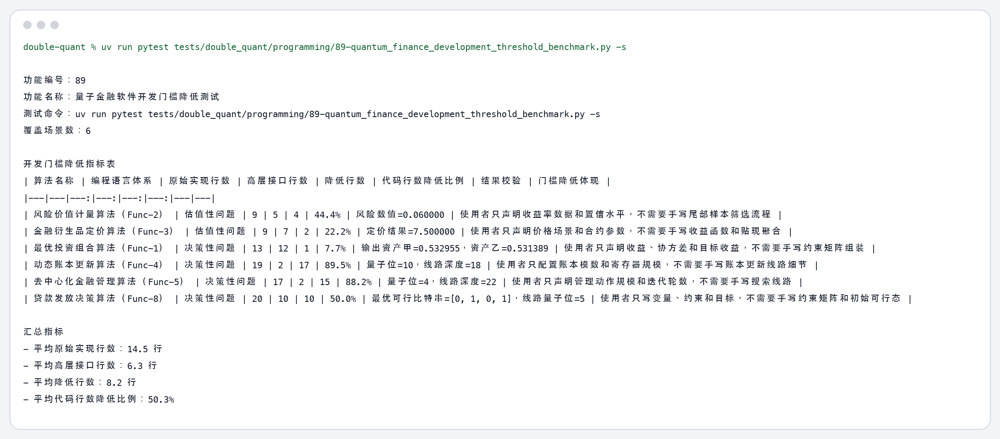
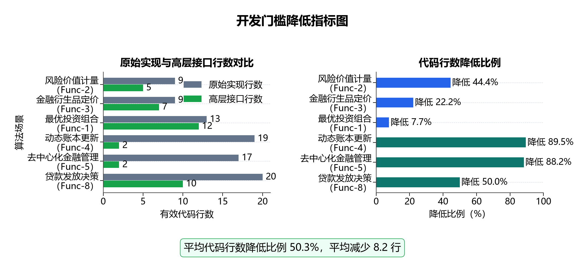

# 89 量子金融软件开发门槛降低测试（Perf-34） 测试结果

## 测试命令

```bash
uv run pytest tests/double_quant/programming/89-quantum_finance_development_threshold_benchmark.py -s
```

## 程序输出

```text
功能编号：89
功能名称：量子金融软件开发门槛降低测试
测试命令：uv run pytest tests/double_quant/programming/89-quantum_finance_development_threshold_benchmark.py -s
覆盖场景数：6

开发门槛降低指标表
| 算法名称 | 编程语言体系 | 原始实现行数 | 高层接口行数 | 降低行数 | 代码行数降低比例 | 结果校验 | 门槛降低体现 |
|---|---|---:|---:|---:|---:|---|---|
| 风险价值计量算法（Func-2） | 估值性问题 | 9 | 5 | 4 | 44.4% | 风险数值=0.060000 | 使用者只声明收益率数据和置信水平，不需要手写尾部样本筛选流程 |
| 金融衍生品定价算法（Func-3） | 估值性问题 | 9 | 7 | 2 | 22.2% | 定价结果=7.500000 | 使用者只声明价格场景和合约参数，不需要手写收益函数和贴现聚合 |
| 最优投资组合算法（Func-1） | 决策性问题 | 13 | 12 | 1 | 7.7% | 输出资产甲=0.532955，资产乙=0.531389 | 使用者只声明收益、协方差和目标收益，不需要手写约束矩阵组装 |
| 动态账本更新算法（Func-4） | 决策性问题 | 19 | 2 | 17 | 89.5% | 量子位=10，线路深度=18 | 使用者只配置账本模数和寄存器规模，不需要手写账本更新线路细节 |
| 去中心化金融管理算法（Func-5） | 决策性问题 | 17 | 2 | 15 | 88.2% | 量子位=4，线路深度=22 | 使用者只声明管理动作规模和迭代轮数，不需要手写搜索线路 |
| 贷款发放决策算法（Func-8） | 决策性问题 | 20 | 10 | 10 | 50.0% | 最优可行比特串=[0, 1, 0, 1]，线路量子位=5 | 使用者只写变量、约束和目标，不需要手写约束矩阵和初始可行态 |

汇总指标
- 平均原始实现行数：14.5 行
- 平均高层接口行数：6.3 行
- 平均降低行数：8.2 行
- 平均代码行数降低比例：50.3%
```

## 图片输出





## 关键指标

| 算法名称 | 编程语言体系 | 原始实现行数 | 高层接口行数 | 降低行数 | 代码行数降低比例 |
|---|---|---:|---:|---:|---:|
| 风险价值计量算法（Func-2） | 估值性问题 | 9 | 5 | 4 | 44.4% |
| 金融衍生品定价算法（Func-3） | 估值性问题 | 9 | 7 | 2 | 22.2% |
| 最优投资组合算法（Func-1） | 决策性问题 | 13 | 12 | 1 | 7.7% |
| 动态账本更新算法（Func-4） | 决策性问题 | 19 | 2 | 17 | 89.5% |
| 去中心化金融管理算法（Func-5） | 决策性问题 | 17 | 2 | 15 | 88.2% |
| 贷款发放决策算法（Func-8） | 决策性问题 | 20 | 10 | 10 | 50.0% |

## 总体结论

- 6 个代表场景的平均代码行数降低比例为 50.3%。
- 代码行数降低比例最高的场景是“动态账本更新算法（Func-4）”，降低比例为 89.5%。
- 结果文档只展示十类算法名称和两类编程语言体系。
- 代码示例文件已输出到本目录的 `code_examples` 子目录。