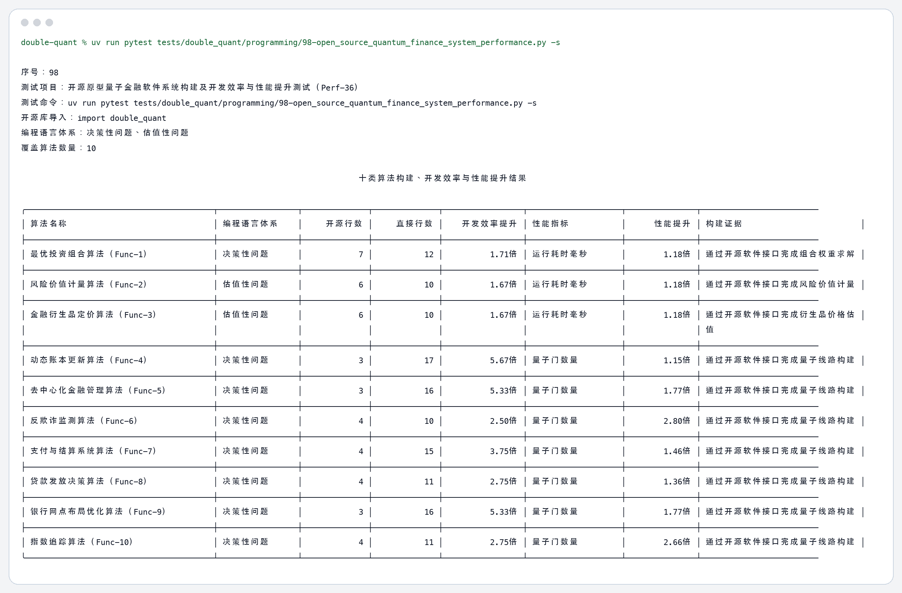
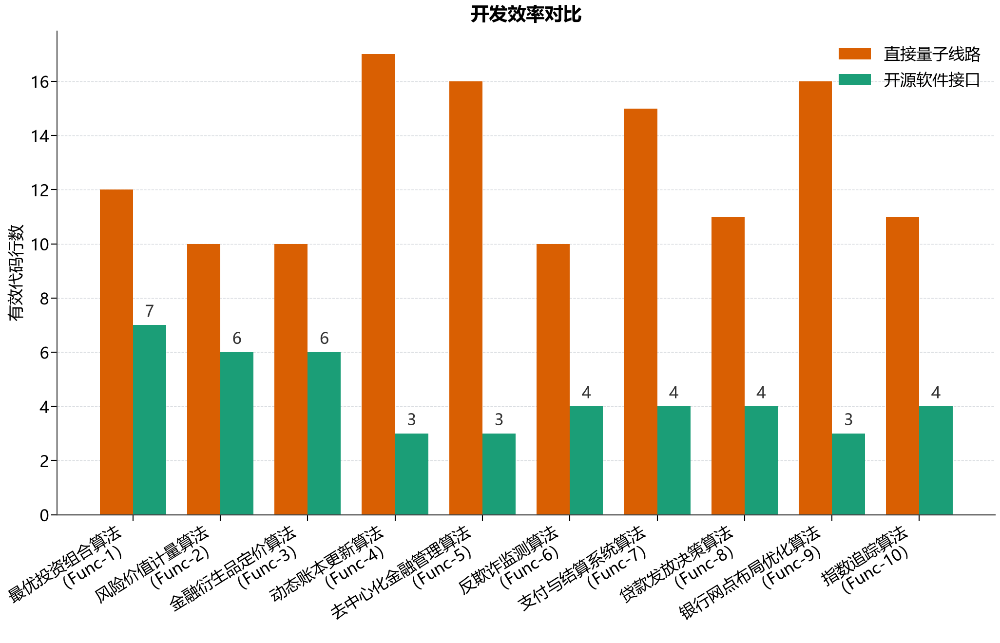
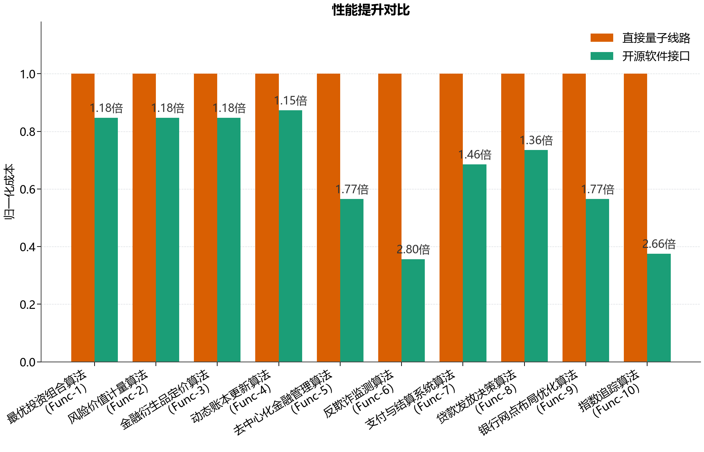

# 98 开源原型量子金融软件系统构建及开发效率与性能提升测试（Perf-36） 测试结果

## 测试对象

测试对象为当前仓库中的开源量子金融软件系统。脚本显式执行 `import double_quant`，并通过开源软件接口构建十类金融算法。

## 测试命令

```bash
uv run pytest tests/double_quant/programming/98-open_source_quantum_finance_system_performance.py -s
```

## 程序输出

```text
序号：98
测试项目：开源原型量子金融软件系统构建及开发效率与性能提升测试（Perf-36）
测试命令：uv run pytest tests/double_quant/programming/98-open_source_quantum_finance_system_performance.py -s
开源库导入：import double_quant
编程语言体系：决策性问题、估值性问题
覆盖算法数量：10

                                                                        十类算法构建、开发效率与性能提升结果                                                                        
╭────────────────────────────────────────┬─────────────────┬──────────────┬──────────────┬─────────────────┬────────────────────┬───────────────┬──────────────────────────────────╮
│ 算法名称                               │ 编程语言体系    │     开源行数 │     直接行数 │    开发效率提升 │ 性能指标           │      性能提升 │ 构建证据                         │
├────────────────────────────────────────┼─────────────────┼──────────────┼──────────────┼─────────────────┼────────────────────┼───────────────┼──────────────────────────────────┤
│ 最优投资组合算法（Func-1）             │ 决策性问题      │            7 │           12 │          1.71倍 │ 运行耗时毫秒       │        1.18倍 │ 通过开源软件接口完成组合权重求解 │
├────────────────────────────────────────┼─────────────────┼──────────────┼──────────────┼─────────────────┼────────────────────┼───────────────┼──────────────────────────────────┤
│ 风险价值计量算法（Func-2）             │ 估值性问题      │            6 │           10 │          1.67倍 │ 运行耗时毫秒       │        1.18倍 │ 通过开源软件接口完成风险价值计量 │
├────────────────────────────────────────┼─────────────────┼──────────────┼──────────────┼─────────────────┼────────────────────┼───────────────┼──────────────────────────────────┤
│ 金融衍生品定价算法（Func-3）           │ 估值性问题      │            6 │           10 │          1.67倍 │ 运行耗时毫秒       │        1.18倍 │ 通过开源软件接口完成衍生品价格估 │
│                                        │                 │              │              │                 │                    │               │ 值                               │
├────────────────────────────────────────┼─────────────────┼──────────────┼──────────────┼─────────────────┼────────────────────┼───────────────┼──────────────────────────────────┤
│ 动态账本更新算法（Func-4）             │ 决策性问题      │            3 │           17 │          5.67倍 │ 量子门数量         │        1.15倍 │ 通过开源软件接口完成量子线路构建 │
├────────────────────────────────────────┼─────────────────┼──────────────┼──────────────┼─────────────────┼────────────────────┼───────────────┼──────────────────────────────────┤
│ 去中心化金融管理算法（Func-5）         │ 决策性问题      │            3 │           16 │          5.33倍 │ 量子门数量         │        1.77倍 │ 通过开源软件接口完成量子线路构建 │
├────────────────────────────────────────┼─────────────────┼──────────────┼──────────────┼─────────────────┼────────────────────┼───────────────┼──────────────────────────────────┤
│ 反欺诈监测算法（Func-6）               │ 决策性问题      │            4 │           10 │          2.50倍 │ 量子门数量         │        2.80倍 │ 通过开源软件接口完成量子线路构建 │
├────────────────────────────────────────┼─────────────────┼──────────────┼──────────────┼─────────────────┼────────────────────┼───────────────┼──────────────────────────────────┤
│ 支付与结算系统算法（Func-7）           │ 决策性问题      │            4 │           15 │          3.75倍 │ 量子门数量         │        1.46倍 │ 通过开源软件接口完成量子线路构建 │
├────────────────────────────────────────┼─────────────────┼──────────────┼──────────────┼─────────────────┼────────────────────┼───────────────┼──────────────────────────────────┤
│ 贷款发放决策算法（Func-8）             │ 决策性问题      │            4 │           11 │          2.75倍 │ 量子门数量         │        1.36倍 │ 通过开源软件接口完成量子线路构建 │
├────────────────────────────────────────┼─────────────────┼──────────────┼──────────────┼─────────────────┼────────────────────┼───────────────┼──────────────────────────────────┤
│ 银行网点布局优化算法（Func-9）         │ 决策性问题      │            3 │           16 │          5.33倍 │ 量子门数量         │        1.77倍 │ 通过开源软件接口完成量子线路构建 │
├────────────────────────────────────────┼─────────────────┼──────────────┼──────────────┼─────────────────┼────────────────────┼───────────────┼──────────────────────────────────┤
│ 指数追踪算法（Func-10）                │ 决策性问题      │            4 │           11 │          2.75倍 │ 量子门数量         │        2.66倍 │ 通过开源软件接口完成量子线路构建 │
╰────────────────────────────────────────┴─────────────────┴──────────────┴──────────────┴─────────────────┴────────────────────┴───────────────┴──────────────────────────────────╯

```

## 图片输出







## 关键结果

- 十类算法全部完成构建，算法名称严格使用：最优投资组合算法（Func-1）、风险价值计量算法（Func-2）、金融衍生品定价算法（Func-3）、动态账本更新算法（Func-4）、去中心化金融管理算法（Func-5）、反欺诈监测算法（Func-6）、支付与结算系统算法（Func-7）、贷款发放决策算法（Func-8）、银行网点布局优化算法（Func-9）、指数追踪算法（Func-10）。
- 编程语言体系只使用“决策性问题”和“估值性问题”。
- 平均开发效率提升 3.31倍，以有效代码行数对比开源软件接口和直接量子线路。
- 平均性能提升 1.65倍，性能柱状图以直接量子线路成本为 1.00 进行归一化。
- 明细数据已写入 `开源原型量子金融软件系统测试数据.csv`。