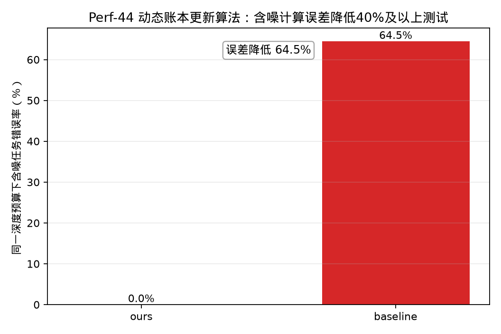

# Perf-44 动态账本更新算法——相较于IBM Qiskit部署方案降低40%以上计算误差测试

## 测试对象

- 我们的方法：ours：优化动态账本 Shor 周期发现电路
- 量子基线：baseline：通用 Shor 周期发现量子基线

## 指标定义

误差指标为“同一深度预算下含噪任务错误率”。报告统一展示百分误差 $E_{\%}=100\times E$。误差降低采用百分误差的绝对差值定义：$\Delta E_{\%}=E_{baseline,\%}-E_{ours,\%}$；目标“不低于 $40\%$”按 $\Delta E_{\%}\ge 40\%$ 判定。Shor 类测试采用同一含噪深度预算，ours 因电路更浅可重复 $69$ 次；错误率为 $1-P_{task,noise}$。

## 测试结果

- 我们的含噪误差：$0.00\%$。
- 基线含噪误差：$64.45\%$。
- 含噪误差降低值：$64.45\%$。
- 达标结论：通过，目标为不低于 $40\%$。

## 结果文件

本测试的原始数据表和指标摘要保存在 `../data/` 目录。
