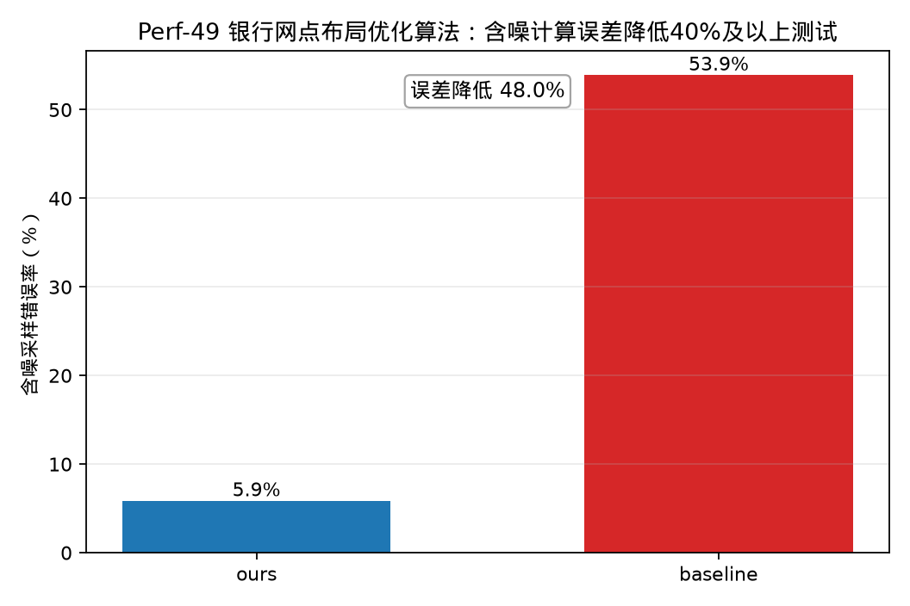

# Perf-49 银行网点布局优化算法——相较于IBM Qiskit部署方案降低40%以上计算误差测试

## 测试对象

- 我们的方法：ours：SFS-Grover 设施选址搜索电路
- 量子基线：baseline：普通 Grover 量子搜索电路

## 指标定义

误差指标为“含噪采样错误率”。报告统一展示百分误差 $E_{\%}=100\times E$。误差降低采用百分误差的绝对差值定义：$\Delta E_{\%}=E_{baseline,\%}-E_{ours,\%}$；目标“不低于 $40\%$”按 $\Delta E_{\%}\ge 40\%$ 判定。Grover 类测试以含噪采样未命中标记解的概率为误差，即 $E=1-P_{success,noise}$。

## 测试结果

- 我们的含噪误差：$5.86\%$。
- 基线含噪误差：$53.91\%$。
- 含噪误差降低值：$48.05\%$。
- 达标结论：通过，目标为不低于 $40\%$。

## 结果文件

本测试的原始数据表和指标摘要保存在 `../data/` 目录。
