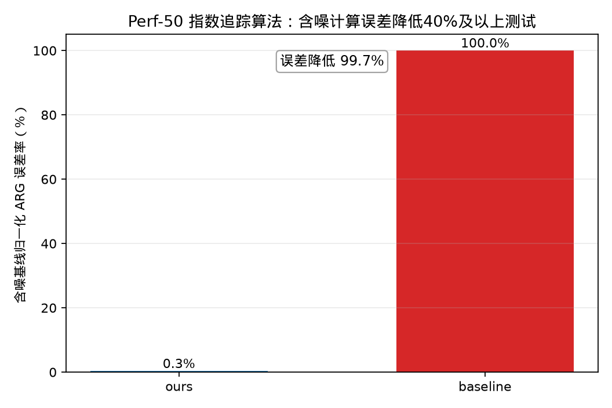

# Perf-50 指数追踪算法——相较于IBM Qiskit部署方案降低40%以上计算误差测试

## 测试对象

- 我们的方法：ours：Rasengan 行业约束篮子搜索电路
- 量子基线：baseline：Penalty-QAOA 电路

## 指标定义

误差指标为“含噪基线归一化 ARG 误差率”。报告统一展示百分误差 $E_{\%}=100\times E$。误差降低采用百分误差的绝对差值定义：$\Delta E_{\%}=E_{baseline,\%}-E_{ours,\%}$；目标“不低于 $40\%$”按 $\Delta E_{\%}\ge 40\%$ 判定。Rasengan 类测试先计算含噪 $ARG$。为使误差百分比保持在 $0\%$ 到 $100\%$ 内，本测试用基线 ARG 归一化：$E_{ours}=ARG_{ours}/ARG_{baseline}$，$E_{baseline}=1$。因此 baseline 为 $100\%$，ours 表示相对 baseline 剩余多少误差。

## 测试结果

- 我们的含噪误差：$0.32\%$。
- 基线含噪误差：$100.00\%$。
- 含噪误差降低值：$99.68\%$。
- 达标结论：通过，目标为不低于 $40\%$。

## 结果文件

本测试的原始数据表和指标摘要保存在 `../data/` 目录。
