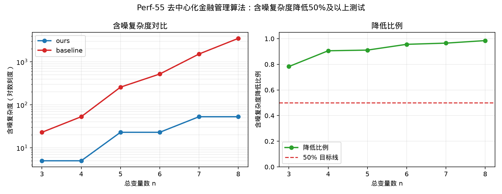

# Perf-55 去中心化金融管理算法——相较于IBM Qiskit部署方案降低50%以上量子计算复杂度测试

## 测试对象

- 我们的方法：ours：SFS+Grover 压缩搜索电路
- 量子基线：baseline：普通 Grover 量子搜索电路

## 指标定义

含噪复杂度降低比例定义为 $1-C_{noise,ours}(n)/C_{noise,baseline}(n)$。图中左侧给出 ours 与 baseline 的含噪复杂度对比；若两者量级差异较大，左图自动使用对数纵轴。右侧给出含噪复杂度降低比例及 50% 目标线。Grover 类测试在含噪模拟器中扫描达到共同成功率阈值所需迭代数，再计算 $C_{noise}=D\times I_{noise}$。

## 测试结果

- 含噪复杂度加速拟合：$S_{noise}(n)=1.2\,2^{0.7\,n}$。
- 含噪复杂度降低中位数：$93.3%$。
- 含噪复杂度降低最小值：$78.3%$。
- 达标结论：通过，目标为不低于 $50\%$。

## 结果文件

本测试的原始数据表和指标摘要保存在 `../data/` 目录。
