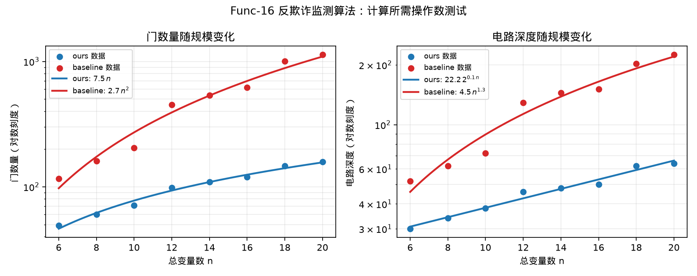

# Func-16 反欺诈监测算法——计算所需操作数测试

## 测试对象

- 我们的方法：ours：Rasengan 约束环路搜索电路
- 量子基线：baseline：Penalty-QAOA 电路

## 指标定义

门数量记为 $G(n)$，电路深度记为 $D(n)$。加速比按 $G_{baseline}(n)/G_{ours}(n)$ 与 $D_{baseline}(n)/D_{ours}(n)$ 计算，均由已验收实验中的真实 Qiskit 电路资源统计得到。由于 ours 与 baseline 的资源量级差异较大，图中纵轴使用对数刻度，避免 ours 曲线被压在横轴附近。

## 测试结果

- 门数量拟合：ours 为 $7.5\,n$，baseline 为 $2.7\,n^{2}$。
- 门数量加速拟合：$S_G(n)=0.4\,n$。
- 门数量中位加速：$4.76\times$。
- 电路深度中位加速：$2.91\times$。
- 达标结论：通过。

## 结果文件

本测试的原始数据表和指标摘要保存在 `../data/` 目录。
