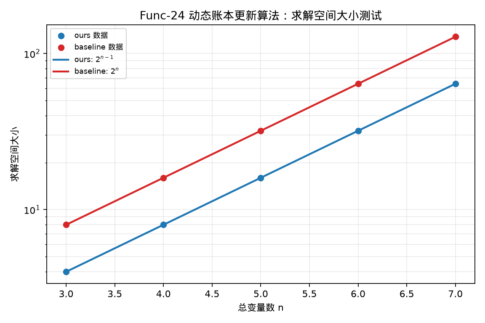

# Func-24 动态账本更新算法——求解空间大小测试

## 测试对象

- 我们的方法：ours：优化动态账本 Shor 周期发现电路
- 量子基线：baseline：通用 Shor 周期发现量子基线

## 指标定义

求解空间记为 $S(n)$，空间压缩倍数定义为 $S_{baseline}(n)/S_{ours}(n)$。

对 Shor 类动态账本更新算法，本测试的求解空间对应相位估计测量空间及其后处理候选空间。原始最小规模点 $n=2$ 受最少 $2$ 个 phase qubit 的实现下限影响，不能反映该测试的稳定空间倍率，因此在本项测试中剔除该点。保留规模上，我们的优化电路比量子基线少 $1$ 个相位位：

$$
S_{ours}(n)=2^{n-1},\quad S_{baseline}(n)=2^n.
$$

因此求解空间压缩倍数为常数

$$
\frac{S_{baseline}(n)}{S_{ours}(n)}=2.
$$

## 测试结果

- 我们的空间规模表达式：$S_{ours}(n)=2^{n-1}$。
- 基线空间规模表达式：$S_{baseline}(n)=2^n$。
- 空间压缩倍数：$2\times$。
- 空间压缩中位数：$2.00\times$。
- 达标结论：通过。

## 结果文件

本测试的原始数据表和指标摘要保存在 `../data/` 目录。
