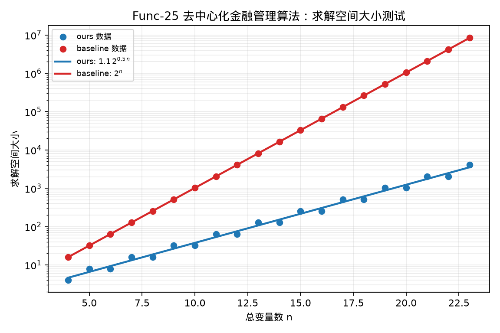

# Func-25 去中心化金融管理算法——求解空间大小测试

## 测试对象

- 我们的方法：ours：SFS+Grover 压缩搜索电路
- 量子基线：baseline：普通 Grover 量子搜索电路

## 指标定义

求解空间记为 $S(n)$，空间压缩倍数定义为 $S_{baseline}(n)/S_{ours}(n)$。Shor 类测试中，求解空间对应相位估计测量空间及其后处理候选空间；其余算法中，求解空间为被量子搜索或变分搜索覆盖的二元状态空间。

## 测试结果

- 我们的空间拟合：$S_{ours}(n)=1.1\,2^{0.5\,n}$。
- 基线空间拟合：$S_{baseline}(n)=2^{n}$。
- 空间压缩拟合：$S_{baseline}(n)/S_{ours}(n)=0.9\,2^{0.5\,n}$。
- 空间压缩中位数：$96.00\times$。
- 达标结论：通过。

## 结果文件

本测试的原始数据表和指标摘要保存在 `../data/` 目录。
