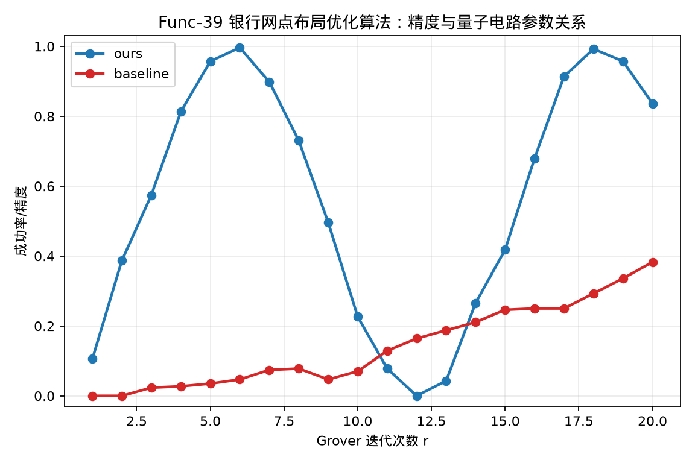

# Func-39 银行网点布局优化算法——计算精度与量子电路参数之间的函数关系测试

## 测试对象

- 我们的方法：ours：SFS-Grover 设施选址搜索电路
- 量子基线：baseline：普通 Grover 量子搜索电路

## 指标定义

量子电路参数为：Grover 迭代次数 r。精度指标为：成功率/精度。Shor 与 Grover 类测试使用采样成功率作为精度，成功率由真实 Qiskit 电路采样结果统计得到。

## 测试结果

- 曲线数据点数量：$20$。
- 达标结论：通过，已给出精度随量子电路参数变化的定量曲线与数据表。

## 结果文件

本测试的原始数据表和指标摘要保存在 `../data/` 目录。
