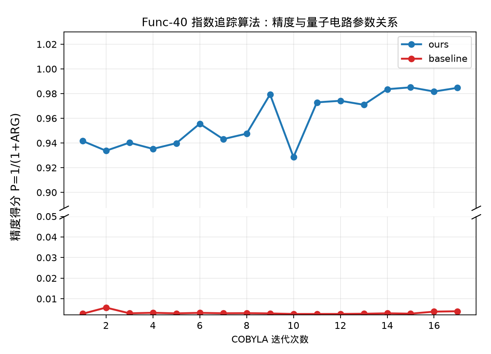

# Func-40 指数追踪算法——计算精度与量子电路参数之间的函数关系测试

## 测试对象

- 我们的方法：ours：Rasengan 行业约束篮子搜索电路
- 量子基线：baseline：Penalty-QAOA 电路

## 指标定义

量子电路参数为：COBYLA 迭代次数。精度指标为：精度得分 P=1/(1+ARG)。Rasengan/Penalty-QAOA 使用 $P=1/(1+ARG)$，其中 $ARG$ 按概率加权的惩罚目标函数计算，不满足约束的样本计入惩罚。

## 测试结果

- 曲线数据点数量：$17$。
- 达标结论：通过，已给出精度随量子电路参数变化的定量曲线与数据表。

## 结果文件

本测试的原始数据表和指标摘要保存在 `../data/` 目录。
