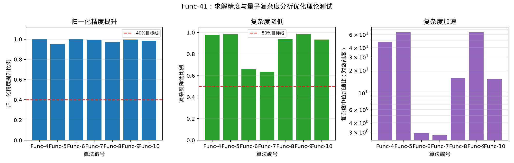

# Func-41 求解精度与量子复杂度分析优化理论测试

## 测试定义

本测试汇总 Func-4 至 Func-10 的已验收实验结果，验证每个量子金融算法都给出了求解精度、量子复杂度和二者之间的可比较关系。精度指标按各算法实验定义选取：Shor 类使用同一深度预算下任务成功率，Grover 类使用同一迭代预算下采样成功率，Rasengan 类使用 $P=1/(1+ARG)$。

归一化精度提升比例定义为 $(P_{ours}-P_{baseline})/(1-P_{baseline})$，表示在 baseline 距满分精度 1 的剩余空间中，ours 弥合的比例。复杂度统一记为 $C(n)$，加速比定义为 $S(n)=C_{baseline}(n)/C_{ours}(n)$；复杂度降低比例定义为 $1-C_{ours}(n)/C_{baseline}(n)$。每个算法的 $S(n)$ 均来自对应实验的拟合曲线。

## 达标判断

归一化精度提升目标为不低于 $40\%$，复杂度降低目标为不低于 $50\%$，且复杂度加速拟合表达式需要随总变量数 $n$ 增长或整体显著大于常数。

| 算法 | 归一化精度提升比例 | 复杂度降低比例 | 复杂度加速拟合表达式 | 结论 |
|---|---:|---:|---|---|
| Func-4 动态账本更新算法 | 100.0% | 97.9% | $11.6\,2^{0.4\,n}$ | 通过 |
| Func-5 去中心化金融管理算法 | 95.4% | 98.4% | $8.5\,2^{0.2\,n}$ | 通过 |
| Func-6 反欺诈监测算法 | 100.0% | 65.7% | $1.2\,2^{0.1\,n}$ | 通过 |
| Func-7 支付与结算系统算法 | 99.4% | 63.4% | $1.5\,2^{0.1\,n}$ | 通过 |
| Func-8 贷款发放决策算法 | 97.3% | 93.6% | $4.7\,2^{0.1\,n}$ | 通过 |
| Func-9 银行网点布局优化算法 | 99.6% | 98.4% | $8.5\,2^{0.2\,n}$ | 通过 |
| Func-10 指数追踪算法 | 98.5% | 93.4% | $4.4\,2^{0.1\,n}$ | 通过 |

总体结论：通过。7 个算法均给出了精度与复杂度的定量定义、实验曲线和随 $n$ 变化的复杂度加速表达式。

## 结果文件

- `../data/theory_summary.csv`
- `../data/metrics.json`
