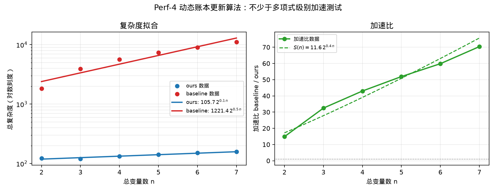

# Perf-4 动态账本更新算法——不少于多项式级别加速测试

## 测试对象

- 我们的方法：ours：优化动态账本 Shor 周期发现电路
- 量子基线：baseline：通用 Shor 周期发现量子基线

## 指标定义

总复杂度 $C(n)$ 采用电路深度乘以迭代次数；Shor 类采用成功率修正复杂度，Grover 类采用 Grover 迭代复杂度，Rasengan 类采用固定 COBYLA 迭代预算下的电路深度复杂度。由于 ours 与 baseline 的复杂度量级差异较大，图中左侧复杂度拟合子图使用对数纵轴。 加速比定义为 $S(n)=C_{baseline}(n)/C_{ours}(n)$。

## 测试结果

- 我们的复杂度拟合：$C_{ours}(n)=105.7\,2^{0.1\,n}$。
- 基线复杂度拟合：$C_{baseline}(n)=1221.4\,2^{0.5\,n}$。
- 拟合加速表达式：$S(n)=11.6\,2^{0.4\,n}$。
- 中位加速比：$47.45\times$。
- 最小加速比：$14.87\times$。
- 达标结论：通过；拟合加速随 $n$ 增长，满足不少于多项式级别加速的测试口径。

## 结果文件

本测试的原始数据表和指标摘要保存在 `../data/` 目录。
