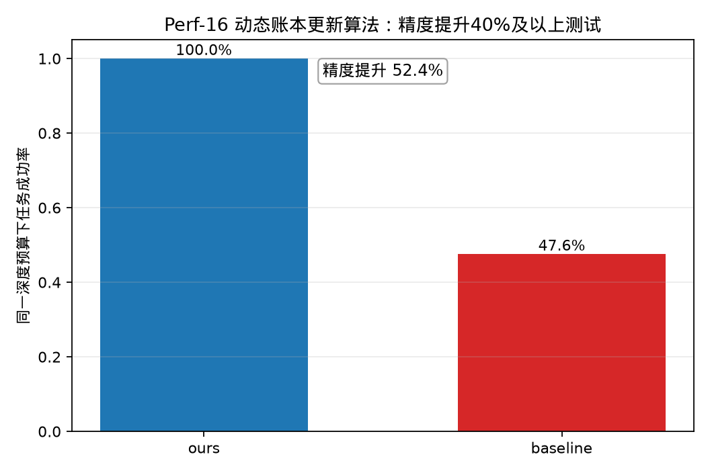

# Perf-16 动态账本更新算法——相较于IBM Qiskit工具精度提升40%及以上测试

## 测试对象

- 我们的方法：ours：优化动态账本 Shor 周期发现电路
- 量子基线：baseline：通用 Shor 周期发现量子基线

## 指标定义

精度指标为“同一深度预算下任务成功率”。精度提升采用绝对差值定义：$\Delta P=P_{ours}-P_{baseline}$。由于 $P\in[0,1]$，目标“不低于 $40\%$”按 $\Delta P\ge 0.40$ 判定，即至少提升 $40$ 个百分点。同一 clean 深度预算 $B=1855$ 下比较任务级成功率。

## 测试结果

- 我们的精度：$1.0000$。
- 基线精度：$0.4756$。
- 精度绝对提升值：$0.5244$（$52.4%$，即 $52.4$ 个百分点）。
- 达标结论：通过，目标为不低于 $40\%$。

## 结果文件

本测试的原始数据表和指标摘要保存在 `../data/` 目录。
