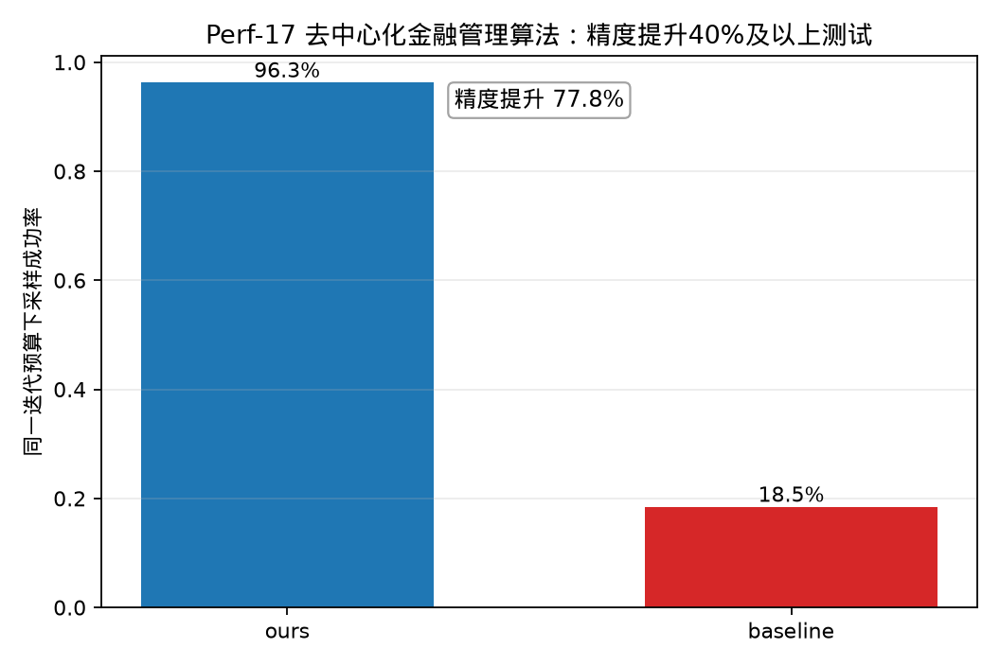

# Perf-17 去中心化金融管理算法——相较于IBM Qiskit工具精度提升40%及以上测试

## 测试对象

- 我们的方法：ours：SFS+Grover 压缩搜索电路
- 量子基线：baseline：普通 Grover 量子搜索电路

## 指标定义

精度指标为“同一迭代预算下采样成功率”。精度提升采用绝对差值定义：$\Delta P=P_{ours}-P_{baseline}$。由于 $P\in[0,1]$，目标“不低于 $40\%$”按 $\Delta P\ge 0.40$ 判定，即至少提升 $40$ 个百分点。同一 Grover 迭代预算 $r=3$ 下比较采样成功率。

## 测试结果

- 我们的精度：$0.9629$。
- 基线精度：$0.1846$。
- 精度绝对提升值：$0.7783$（$77.8%$，即 $77.8$ 个百分点）。
- 达标结论：通过，目标为不低于 $40\%$。

## 结果文件

本测试的原始数据表和指标摘要保存在 `../data/` 目录。
