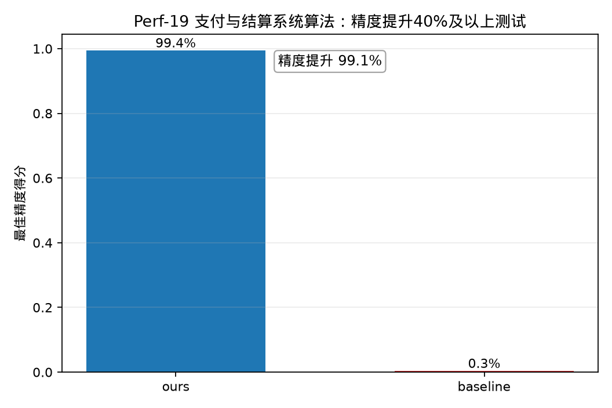

# Perf-19 支付与结算系统算法——相较于IBM Qiskit工具精度提升40%及以上测试

## 测试对象

- 我们的方法：ours：Rasengan 流动性中性搜索电路
- 量子基线：baseline：Penalty-QAOA 电路

## 指标定义

精度指标为“最佳精度得分”。精度提升采用绝对差值定义：$\Delta P=P_{ours}-P_{baseline}$。由于 $P\in[0,1]$，目标“不低于 $40\%$”按 $\Delta P\ge 0.40$ 判定，即至少提升 $40$ 个百分点。Rasengan 与 Penalty-QAOA 使用 $P=1/(1+ARG)$ 作为精度得分，$ARG$ 对不可行样本计入惩罚。

## 测试结果

- 我们的精度：$0.9944$。
- 基线精度：$0.0035$。
- 精度绝对提升值：$0.9909$（$99.1%$，即 $99.1$ 个百分点）。
- 达标结论：通过，目标为不低于 $40\%$。

## 结果文件

本测试的原始数据表和指标摘要保存在 `../data/` 目录。
