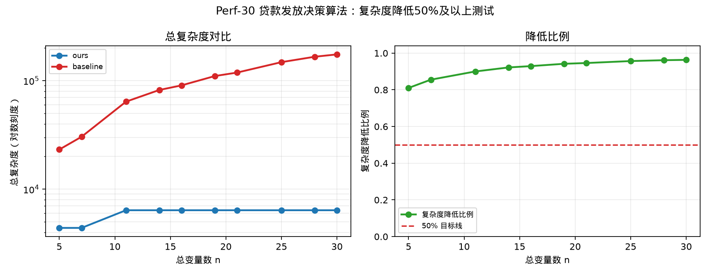

# Perf-30 贷款发放决策算法——相较于IBM Qiskit工具复杂度降低50%及以上测试

## 测试对象

- 我们的方法：ours：Rasengan 分组特征选择电路
- 量子基线：baseline：Penalty-QAOA 电路

## 指标定义

复杂度降低比例定义为 $1-C_{ours}(n)/C_{baseline}(n)$，其中 $C(n)$ 与不少于多项式级别加速测试使用同一复杂度定义。图中左侧给出 ours 与 baseline 的总复杂度对比；若两者量级差异较大，左图自动使用对数纵轴。右侧给出复杂度降低比例及 50% 目标线。

## 测试结果

- 复杂度降低中位数：$93.6%$。
- 最小复杂度降低比例：$81.0%$。
- 达标结论：通过，目标为不低于 $50\%$。

## 结果文件

本测试的原始数据表和指标摘要保存在 `../data/` 目录。
